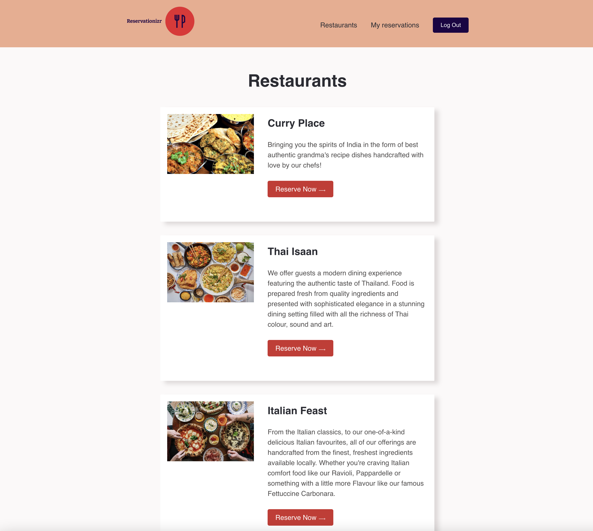
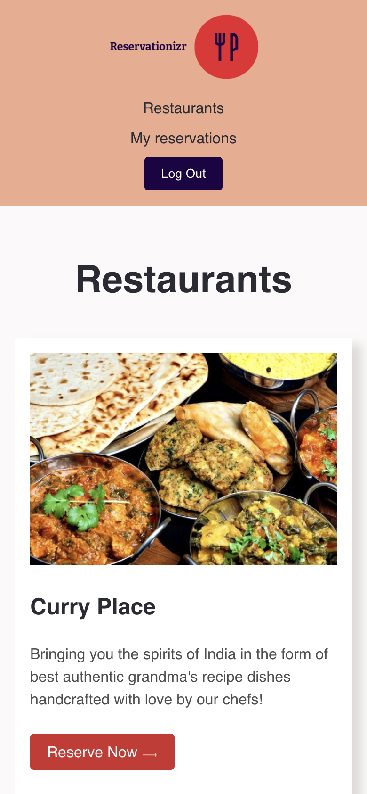

# Project - Reservationizr Application - Manage Reservations

## Preview
[Site Preview](https://reservation-restaurants.onrender.com)

 

---

# Getting started

The `client` folder contains the React Application, and the `server` folder contains the Express application.

## Client

- In a new Terminal window, type: `cd client` to change directory into the client folder
- Type `npm install` to install npm dependencies
- Type `npm start` to start the React Application

## Server

- In a new Terminal window, type: `cd server` to change directory into the server folder
- Type `npm install` to install npm dependencies
- Type `npm start` to start the Express Server

